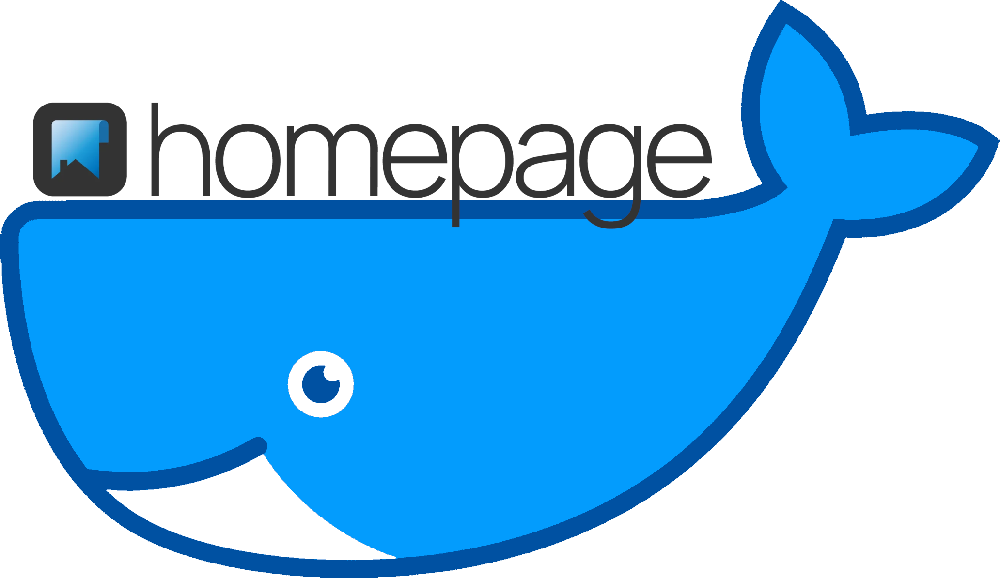

    

    
    

---

Requirements
------------

  - [Docker](https://www.docker.com)
    - [Docker Compose](https://docs.docker.com/compose/)
  - [GNU Make](https://www.gnu.org/software/make/) (optional)

Installation
------------

  1. Clone the repository

         git clone https://github.com/PHLAK/homepage-compose.git

  2. Initialize the configuration files

          make init

     or manually run the commands in `Makefile`

  3. Set the environment variables in `.env`

  4. Set service-specific environment variables by editing the files found in the `environment.d` directory (optional)

  5. Modify the `volumes/homepage/*config*.yaml` files with your configuration options

  6. Run `docker-compose config` to validate and confirm your configuration

  7. Run `docker-compose up -d` to start the containers

Configuration
-------------

Homepage configuration is controlled through the `yaml` files. Reference the
official [Homepage configuration docs](https://gethomepage.dev/configs/) for
more info about the available configuration options.

### Watchtower

Watchtower configuration is controlled through the environment variables set in
the `config/watchtower.env` file. See the [Watchtower documentation](https://containrrr.dev/watchtower/)
(specifically the [Arguments](https://containrrr.dev/watchtower/arguments/) page)
for more information on the available envionment variables and what they do.

Updating Containers
-------------------

This project includes [Watchtower](https://containrrr.dev/watchtower/) which
will periodically check for new images for the tags specified and update your
containers when a new version is found.

To manually fetch updated images and update the running containers run

    docker-compose pull && docker-compose up -d

Default Port Reference
----------------------

| Service  | Port   |
| -------- | ------ |
| Homepage | `3000` |
